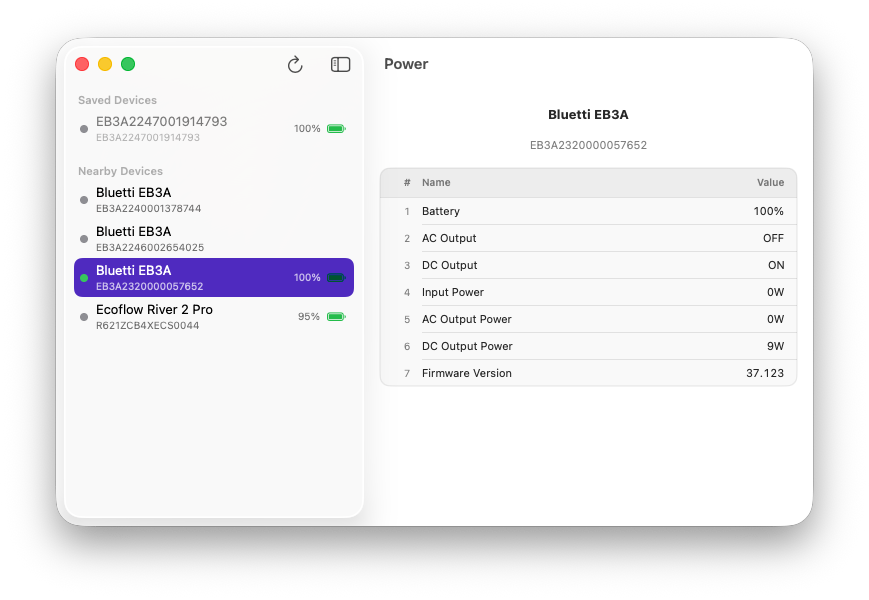

# Power App - Battery Pack Monitoring

## Overview

**Power** is a native macOS application that connects to Bluetooth battery packs and provides real-time monitoring of battery status, charge levels, and device information. Stay informed about your portable power systems with seamless BLE connectivity.

## Features

- **Bluetooth Discovery**: Automatically discover compatible battery devices via BLE
- **Real-time Monitoring**: Track battery status, charge levels, and vital information
- **Device Management**: Add devices to favorites for quick access
- **WiFi Binding** (Optional): Connect devices via WiFi for extended control

## Supported Devices

- **Ecoflow**: River 2 (Max, Pro), Delta 2 (Max, Pro)
- **Bluetti**: EB3A and other compatible models
- **Jk-BMS**: JK-BMS20S001, JK-BMS20S002, ...

## Installation

### Download

Download the latest release from the [Releases page](https://github.com/bossly/powerapp/releases).

### Install from DMG

1. Download `Power-vX.X.X-macOS.dmg` from the latest release
2. Double-click the `.dmg` file to mount it
3. Drag **Power.app** to the **Applications** folder
4. Eject the DMG (right-click → Eject in Finder)
5. Open **Power** from Applications

### ⚠️ First Launch — Gatekeeper Warning

Since Power is self-signed (not notarized by Apple), macOS will block it on first launch. This is expected behavior for apps distributed outside the Mac App Store.

**Method 1: Right-Click → Open (Recommended)**
1. In Finder, navigate to **Applications**
2. **Right-click** (or Control-click) on **Power.app**
3. Select **Open** from the context menu
4. Click **Open** in the dialog that appears
5. The app will now open normally every time

**Method 2: System Settings**
1. Try to open Power.app normally (it will be blocked)
2. Open **System Settings** → **Privacy & Security**
3. Scroll down to the **Security** section
4. You'll see a message: *"Power was blocked from use because it is not from an identified developer"*
5. Click **Open Anyway**
6. Enter your password and click **Open**

## Disclaimer

Power App is an independent application and is not affiliated with, authorized, maintained, sponsored, or endorsed by Bluetti, Ecoflow, JK-BMS, or any of their affiliates or subsidiaries. All product and company names are the registered trademarks of their original owners. The use of any trade name or trademark is for identification and reference purposes only and does not imply any association with the trademark holder or their product brand.
